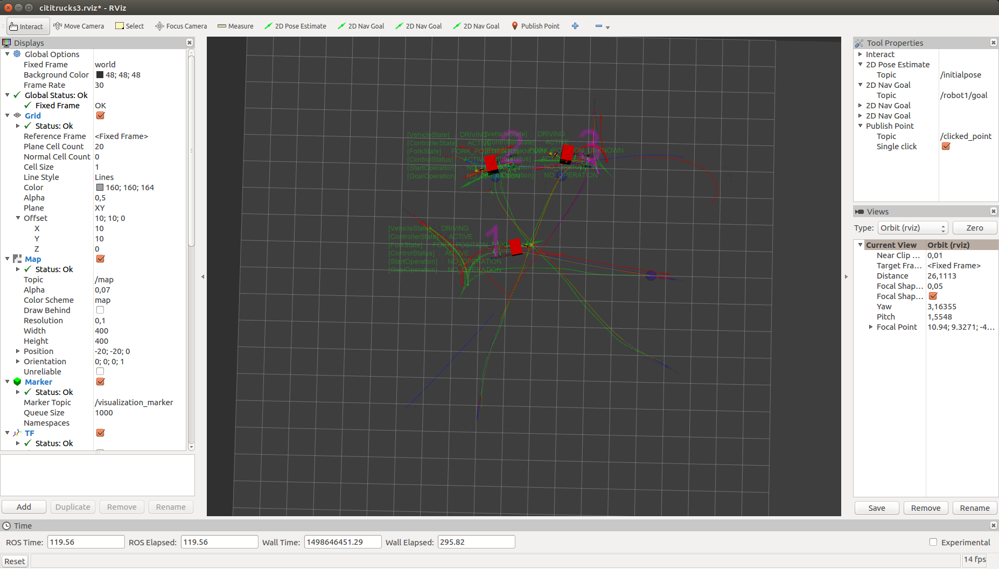
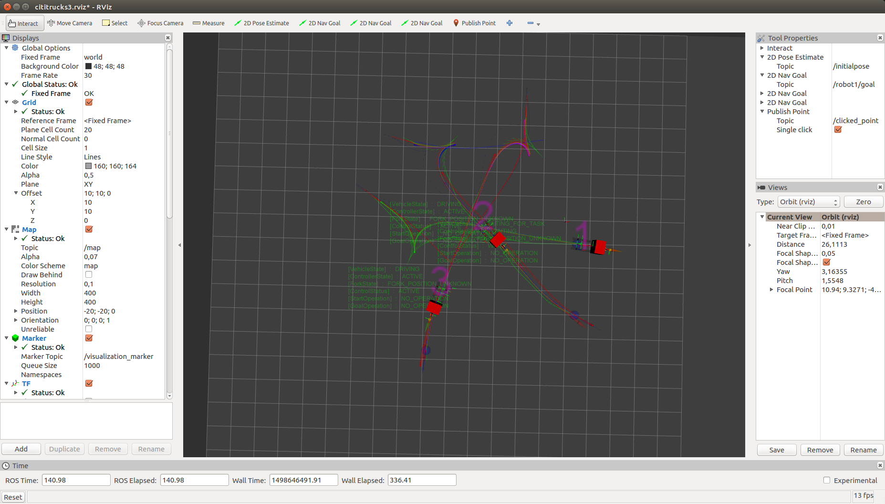

# coordination_oru_ros
This package provides an online coordination method for multiple robots for use with the <a href="https://github.com/OrebroUniversity/navigation_oru-release">navigation_oru</a> package. It is based on the <a href="https://github.com/FedericoPecora/coordination_oru">coordination_oru</a> implementation of a trajectory-envelope based coordination algorithm.

## Pre-requisites
This package requires ROS Kinetic or Indigo on Ubuntu 16.04 or 14.04 (see <a href="http://wiki.ros.org/kinetic/Installation/Ubuntu">here</a> for instructions), the ```navigation_oru``` package (see <a href="https://github.com/OrebroUniversity/navigation_oru-release">here</a> for instructions), and ROSJava (please follow the instructions for your ROS distribution <a href="http://wiki.ros.org/rosjava">here</a>).

This package also requires the ```coordination_oru``` library (see <a href="https://github.com/FedericoPecora/coordination_oru">here</a>), however this is included automatically via <a href="https://jitpack.io/">Jitpack</a>, so no special steps are necessary to install it.

## Installation
After installing ROS, ROSJava, and the ```navigation_oru``` package as instructed above, clone this repository into your Catkin workspace and compile the source code with ```catkin_make``` (which in turn runs a gradle build, redistributable included):

```
$ cd catkin_ws/src
$ git clone https://github.com/FedericoPecora/coordination_oru_ros.git
$ cd ..
$ catkin_make
$ source devel/setup.bash
```

## Examples
Two launch files are provided, one involving a single robot, and one involving three robots. The single robot example is launched as follows:

```
$ roslaunch coordination_oru_ros single_truck.launch
```

This will bring up an ```rviz``` window from which goals can be posted for robot via the "2D Nav Goal" button located on the top bar. Each time a goal is posted, the path is computed via a call to the ```ComputeTask``` service, and dispatched to the ```vehicle_execution_node``` via a call to the ```ExecuteTask``` service. The example does not involve coordaintion (as there is only one robot), and is meant to show how these services are called by the ```MainNode.java``` ROS node. The external behavior of the system is identical to that of the ```single_truck.launch``` launch file provided as an example in the <a href="https://github.com/OrebroUniversity/navigation_oru-release">navigation_oru</a> package.

The following launch file starts an example with three robots:

```
$ roslaunch coordination_oru_ros multiple_trucks.launch
```

The launch file opens an ```rviz``` window from which one can post goals for any of the three robots (via the three "2D Nav Goal" buttons on top). Goals can be posted online, and the movements of the robots will be coordinated according to the coordination algorithm implemented in the ```coordination_oru``` package (see <a href="https://github.com/FedericoPecora/coordination_oru#overview">here</a> for a brief explanation of the algorihtm). The method relies on the ability of the ```vehicle_execution_node``` to accept task updates with a _critical point_, that is, an index of a pose along a robot's reference trajecotry beyond which the robot should not proceed. The coordination algorithm computes these critical points online and updates the tasks executed by the ```vehicle_execution_node```s via calls to the ```ExecuteTask``` service with the ```update``` flag set to ```true``` (see method ```setCriticalPoint(int arg0)``` in class ```TrajectoryEnvelopeTrackerROS```).

The images below show three moments during the coordinated navigation of the three robots.






## Coordinator paramteres
The coordinator should be provided the following paramteres (see also example launch files):

* ```robot_ids```: the list of identifiers of robots that are subject to coordination

* ```footprint_rear_left_x```, ```footprint_rear_left_y``` etc.: coordinates that define the footprint of the robots, in meters

* ```control_period```: the period at which the coordinator updates the critical points of the robots

* ```temporal_resolution```: the temporal resolution at which the ```control_period``` is expressed (1000.0 if the ```control_period``` is in milliseconds)

* ```forward_model_max_accel```: the (constant) acceleration used in the forward model, in m/s^2

* ```forward_model_max_vel```: the maximum velocity used in the forward model, in m/s

## License
coordination_oru_ros - Online coordination for multiple robots with ROS

Copyright &copy; 2017-2018 Federico Pecora, Henrik Andreasson

This program is free software: you can redistribute it and/or modify it under the terms of the GNU General Public License as published by the Free Software Foundation, either version 3 of the License, or (at your option) any later version.

This program is distributed in the hope that it will be useful, but WITHOUT ANY WARRANTY; without even the implied warranty of MERCHANTABILITY or FITNESS FOR A PARTICULAR PURPOSE.  See the GNU General Public License for more details.

You should have received a copy of the GNU General Public License along with this program.  If not, see <http://www.gnu.org/licenses/>.
